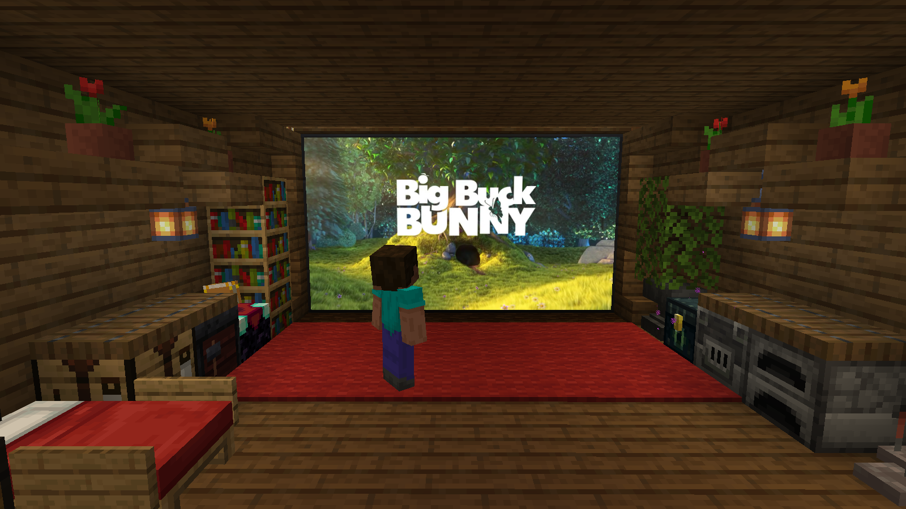

# Desktop Screens



Your real PC desktop, inside Minecraft. Build a screen of any size in your base, turn it on, and it shows your desktop, live. Walk up to it, press **G**, and your real mouse and keyboard work on it. Tap **Right Ctrl** and you're back in the game.

**Beta.** Minecraft 1.21.1, NeoForge and Fabric. Windows 10 (version 2004 or newer) and Windows 11. Needed on the server and in each player's game. Mac and Linux players can join and watch screens shared with them.

Download: [Modrinth](MODRINTH-LINK) · [CurseForge](CURSEFORGE-LINK)

## What's in it

- **Screens:** thin panels for walls, floors and ceilings. Side by side they join into one big screen. Right-click one with an empty hand to turn it on: it shows your desktop, only to you.
- **Screen Builder:** builds a whole screen at once, up to 32 × 32 blocks, with a hologram that follows your view. Shift-click a screen to move it, resize it or take it down.
- **Tablet:** right-click it, or press G while it's in your inventory.
- **Its own picture on every screen:** each screen can show a different monitor or just one window.
- **Sharing:** add friends by name; they see your screen and hear your PC near it (never Minecraft or your voice chat).
- **Picture-in-picture:** a window, small in a corner while you play.

## Keys

- **G:** use the screen you're looking at (or, with a tablet in your inventory, the desktop anywhere).
- **Right Ctrl** (tap): back to the game. So does switching to Minecraft (Alt+Tab or its taskbar button).
- **Right Ctrl + M:** next monitor. **+ W:** just the window under the mouse. **+ O:** settings. **+ P:** pin a window for picture-in-picture. **+ F:** framed view. **+ S:** scaling. **+ mouse wheel** (or Up/Down): zoom.

Right Ctrl belongs to the mod while you use the desktop; use Left Ctrl for shortcuts in your apps. Every key can be changed in Controls, under "Desktop Screens".

## For servers and modpacks

- Nothing to install besides the jar (and Fabric API on Fabric; Mod Menu is optional).
- The Screen Builder asks land-claim mods before it builds, moves or takes down a screen (tested with FTB Chunks, Open Parties and Claims and Flan).
- Recipes are data files. Server settings are in `config/desktopscreens-server.properties`: the biggest screen, the builder's range, and whether sharing (and its sound) is allowed, with limits for shared pictures.

## Reporting bugs

Please open an [issue](../../issues) with your loader, your Windows version and how many monitors you have, and attach `logs/latest.log` from your Minecraft folder.

## Building

Needs a Java 21 JDK.

```
gradlew build                 # jars end up in fabric/build/libs and neoforge/build/libs
gradlew :neoforge:runClient   # start Minecraft with the mod (NeoForge)
gradlew :fabric:runClient     # start Minecraft with the mod (Fabric)
```

`tools\server.cmd neoforge | fabric | vanilla` starts a local test server for those clients to join at `127.0.0.1`.

| Folder | What's in it |
|---|---|
| `core/` | Plain Java, no Minecraft: screen capture, mouse/keyboard handover, moving windows. Java 8 compatible, so other Minecraft versions can reuse it. |
| `common/` | Minecraft 1.21.1 code shared by both loaders. |
| `fabric/`, `neoforge/` | Loader entry points. Each builds its own mod jar containing core + common. |

## License

MIT, see [LICENSE](LICENSE).

The jars include [Concentus](https://github.com/lostromb/concentus) (Opus in pure Java, for the shared sound) under its BSD 3-Clause license, shipped as `LICENSE_concentus`, and the Fabric jar the [Common Protection API](https://github.com/Patbox/common-protection-api) (MIT).

The picture shows *[Big Buck Bunny](https://peach.blender.org)*, © Blender Foundation, CC BY 3.0.
